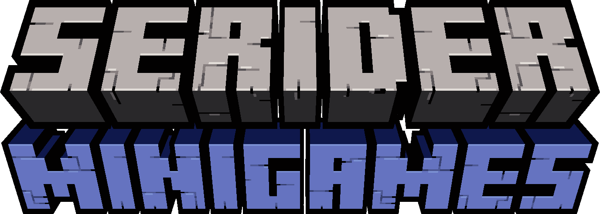
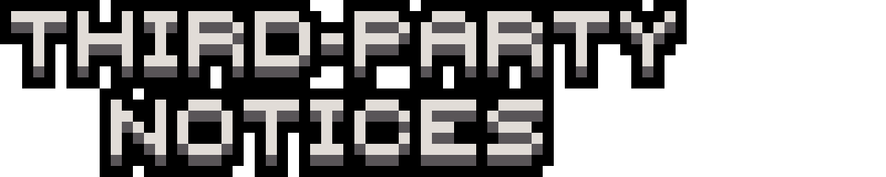

<h1>
  

    </img>
    </img>
  

  

    
    
  

</h1>

### All of the resources needed to play on **Serider Minigames** are compiled into easily sharable `.zip` files, for quick updates and quicker implementation.

> **If you have already read this, move over [here](READMETOO.md "Work In Progress")!**

## 

Want to help us translate the resource packs into a language that you know?
We Have a GitLocalize page [here](https://gitlocalize.com/repo/6274) that you can use to easily translate the resource packs.

> Confused by the `%s` symbol? It's just a magic symbol that allows us to put specific data into the translation.

Can't see the language that you want to translate to on the list? Create a [new issue](https://github.com/Serider-Minigames/Resource-Packs/issues/new?assignees=&labels=Translation+Request&template=translation-request.md&title=Add+%28language%29+as+a+new+language) or contact us on Discord.

## 

> **Already know how to use GitHub? Move to the next section.**

To upload resources to the repository, there are a few Git clients that you can use:

> - [GitHub Desktop](https://desktop.github.com/ "Official Website")
>   - This is the easiest tool to interract with github repositories.
> - [Tortoise Git](https://tortoisegit.org/ "Official Website")
>   - On-desktop alternative that doesn't have a GUI, for more experienced users.
> - [Git](https://git-scm.com/ "Official Website")
>   - Not actually a client, but useful if you are a nerd who likes using terminals.

> *Other Git clients can be found [here](https://git-scm.com/downloads/guis).*

To get started, create a [new fork](https://github.com/Serider-Minigames/Resource-Packs/fork) (a new version of the repository for yourself) and [clone the fork](https://docs.github.com/en/github/creating-cloning-and-archiving-repositories/cloning-a-repository-from-github/cloning-a-repository) to your computer.

## 

If you are uploading textures for a specific artstyle, put them in the correct path in the [`jappa`](https://github.com/Serider-Minigames/Resource-Packs/tree/main/jappa), [`classic`](https://github.com/Serider-Minigames/Resource-Packs/tree/main/classic) or other artstyle specific folders.

If you are uploading shared resources, such as translation files, sound files or any other shared resources, put them in the correct path in the [`shared`](https://github.com/Serider-Minigames/Resource-Packs/tree/main/shared") folder.

To figure out what the correct path for your files is, check the layout of the [`main`](https://github.com/Serider-Minigames/Resource-Packs/tree/main) branch, reference how [minecraft's assets](https://minecraft.fandom.com/wiki/Tutorials/Custom_texture_packs#Extraction) are organized, or ask Heapons or Soumeh.

After uploading your resources, make sure to [commit your changes](https://docs.github.com/en/desktop/contributing-and-collaborating-using-github-desktop/making-changes-in-a-branch/committing-and-reviewing-changes-to-your-project), [push the changes to GitHub](https://docs.github.com/en/desktop/contributing-and-collaborating-using-github-desktop/making-changes-in-a-branch/pushing-changes-to-github) and [create a pull request](https://docs.github.com/en/desktop/contributing-and-collaborating-using-github-desktop/working-with-your-remote-repository-on-github-or-github-enterprise/creating-an-issue-or-pull-request#creating-a-pull-request).

If you need any help, contact Heapons or Soumeh.

## 

> - [`shared`](https://github.com/Serider-Minigames/Resource-Packs/tree/main/shared)
>   - Shared Assets (Fonts, Models, Sounds, Etc.)
> - [`jappa`](https://github.com/Serider-Minigames/Resource-Packs/tree/main/jappa)
>   - JAPPA's Artstyle
> - [`classic`](https://github.com/Serider-Minigames/Resource-Packs/tree/main/classic)
>   - Pre-1.14 Artstyle
> - [`add-ons`](https://github.com/Serider-Minigames/Resource-Packs/tree/main/add-ons)
>   - Vanilla Tweaks/Enhancements (JAPPA's Artstyle)

> **Want to add your own artstyle? Put any of your textures inside of a new folder named after the style.**

# 

> - [Negative Space Font](https://github.com/AmberWat/NegativeSpaceFont)
>   - For making custom GUIs more easily.

###### Written by  [**Soumeh**](https://github.com/Soumeh) &  [**Heapons**](https://github.com/Heapons); prettified by  [**Heapons**](https://github.com/Heapons); pimped out by  [**Soumeh**](https://github.com/Soumeh).
